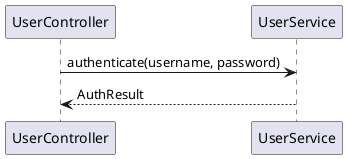
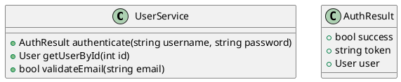
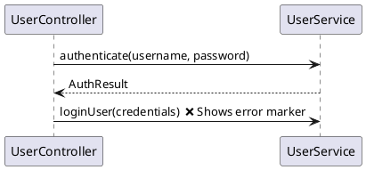

# PlantUML Editor

A modern, AI-powered WPF desktop application for creating and editing PlantUML diagrams with integrated Azure OpenAI support.


## Features

### Core Functionality
- **Multi-Diagram Support**: Create and edit Class, Sequence, and Component diagrams
- **Live Preview**: Real-time diagram rendering with PlantUML
- **File Management**: Workspace-based project organization with folder tree navigation
- **Git Integration**: Built-in Git status monitoring, branch tracking, and change management
- **Document Templates**: Customizable templates for rapid diagram creation
- **UML Syntax Modes**: Support for both standard PlantUML syntax and pure UML notation

### Type-Safe Diagram Editing
- **Cross-Diagram Validation**: Sequence diagrams validated against class definitions
- **IntelliSense-Style Auto-Complete**: Context-aware suggestions for classes, methods, and properties
- **Real-Time Error Detection**: Immediate feedback on missing classes, methods, or type mismatches
- **Quick Fixes**: One-click commands to create missing classes or methods
- **Go to Definition**: Jump to class/method definitions across files (F12)
- **Find All References**: Discover all usages of classes and methods (F11)
- **Workspace-Wide Type Indexing**: Automatic scanning and indexing of all UML definitions

### AI Capabilities
- **Azure OpenAI Integration**: Built-in AI assistant powered by Azure OpenAI
- **Intelligent Editing**: AI-powered text replacement, insertion, and document rewriting
- **Context-Aware Search**: Search across all documents with intelligent suggestions
- **Document Verification**: Automated PlantUML syntax validation
- **Multi-Modal Support**: Image attachments and clipboard integration for AI interactions
- **Customizable Prompts**: Manage and customize AI system prompts for different use cases
- **Function Confirmation**: Review and approve AI actions before execution

### Editing Experience
- **Syntax Highlighting**: UML and Markdown syntax coloring
- **Auto-Completion**: Intelligent auto-complete for UML elements
- **Code Formatting**: Automatic indentation and formatting
- **Error Reporting**: Real-time syntax error detection and reporting
- **Spell Checking**: Integrated spell-check support
- **Undo/Redo**: Full undo support including AI-generated changes
- **Type-Safe Diagrams**: Cross-diagram type checking and validation
- **Smart Auto-Complete**: Context-aware suggestions for class members, lifelines, and methods
- **Quick Fixes**: One-click commands to fix common diagram errors

### Additional Features
- **Markdown Support**: Create and preview Markdown documentation
- **YAML Editing**: Support for YAML configuration files
- **JSON Documents**: Create and edit JSON files
- **URL Links**: Open and interact with web content directly in the editor
- **DocFX Integration**: Generate documentation with DocFX
- **Web Content**: WebView2 integration for rendering web content and executing JavaScript
- **Image Export**: Export diagrams as PNG or SVG
- **Global Search**: Find text across all files in workspace with regex support

## Requirements

- **Operating System**: Windows 7 or later
- **.NET Runtime**: .NET 9.0
- **Java Runtime**: Required for PlantUML rendering (plantuml.jar included)
- **Azure OpenAI**: Valid endpoint, key, and deployment for AI features (optional)

## Getting Started

### Installation

1. Clone the repository:
   ```bash
   git clone https://github.com/AnQueth/PlantUMLEditor.git
   ```

2. Open the solution in Visual Studio 2022 or later

3. Build the solution:
   ```bash
   dotnet build PlantUMLEditor.sln
   ```

4. Run the PlantUMLEditor project

### First-Time Setup

When you first launch the application:
1. Open a folder to create a workspace
2. Configure settings (optional): Tools → Settings
3. Set up Azure AI (optional): Tools → Settings → AI Configuration

### Configuration

#### Azure AI Setup (Optional)
Configure Azure OpenAI integration in the application settings:
- **Endpoint**: Your Azure OpenAI endpoint URL (e.g., `https://your-resource.openai.azure.com/`)
- **API Key**: Your Azure OpenAI API key
- **Deployment**: Your model deployment name
- **Max Output Tokens**: Maximum tokens for AI responses (default: 2048)

#### Application Settings
- **PlantUML JAR Location**: Path to plantuml.jar (included by default in application directory)
- **Templates Directory**: Location for custom diagram templates (default: Documents/PlantUMLEditor/Templates)
- **Prompts Directory**: Location for AI system prompts
- **DocFX Executable**: Path to DocFX for documentation generation
- **Git Configuration**: Username and email for Git operations
- **UML Pure Mode**: Toggle between standard PlantUML syntax and canonical UML notation
- **Editor Font Size**: Customize editor text size

## Usage

### Creating Diagrams

#### Class Diagram
1. Create a new class diagram using the File menu or New Document commands
2. Edit the PlantUML syntax in the editor:
   ```plantuml
   @startuml
   class User {
       + string username
       + string email
       + void login()
   }
   @enduml
   ```
3. Click **Preview** to view the rendered diagram

**Auto-Complete Features:**
- Type class, interface, or enum names to get intelligent suggestions
- Auto-complete for method signatures and property types
- Suggestions based on existing types in your workspace
- Press `Tab` or `Space` to accept suggestions

#### Sequence Diagram
1. Create a new sequence diagram
2. Define participants and interactions:
   ```plantuml
   @startuml
   actor User
   participant System
   User -> System: login()
   System --> User: response
   @enduml
   ```

**Type-Safe Sequence Diagrams:**
The editor validates sequence diagrams against class diagrams in your workspace:
- **Participant Validation**: Verifies lifelines reference existing classes
- **Method Checking**: Ensures called methods exist in target classes
- **Signature Matching**: Validates method parameters and return types
- **Smart Auto-Complete**: 
  - Type participant names to get class suggestions
  - After `->` get method suggestions from the target class
  - Methods show full signature with parameters

**Example with Type Safety:**


#### Component Diagram
1. Create a new component diagram
2. Define components and relationships:
   ```plantuml
   @startuml
   component WebApp
   component Database
   WebApp --> Database
   @enduml
   ```

**Auto-Complete for Components:**
- Component names and aliases
- Package and namespace suggestions
- Interface definitions

### AI Assistant

The AI assistant can help you create, modify, and understand diagrams.

#### Starting a Conversation
1. Open a document in the editor
2. Select an AI prompt from the dropdown (or use the default)
3. Type your request in the AI chat panel
4. Click **Send** or press **Enter**

#### Example AI Commands
- "Create a class diagram for a user authentication system"
- "Add a method to validate email addresses to the User class"
- "Convert this class diagram to use composition instead of inheritance"
- "Verify this PlantUML file for syntax errors"
- "Search all files for references to 'Authentication'"
- "Create a new sequence diagram showing the login flow"

#### Attaching Files and Images
- Click the **attachment button** to select files
- Press **Ctrl+V** in the chat input to paste images from clipboard
- Supported formats: PNG, JPG, BMP, SVG, TXT, MD, PUML

#### Reviewing AI Actions
When the AI attempts to modify files, you'll see a confirmation dialog:
- **Function Name**: The action being performed
- **Parameters**: Details of the operation
- Click **Yes** to approve or **No** to cancel

#### Undoing AI Changes
- Each AI message shows undo buttons for file modifications
- Click the undo button to revert changes
- Original content is automatically restored

### Working with Templates

Templates allow you to quickly create diagrams from predefined patterns.

#### Creating Templates
1. Click **Tools → Edit Templates**
2. Click **Add Template**
3. Enter a name and content
4. Click **Save**

#### Using Templates
1. Open or create a document
2. Select a template from the dropdown
3. Click **Apply Template**

### Git Integration

The editor provides seamless Git integration:

#### Viewing File Status
- **Green**: New files
- **Orange**: Modified files
- **Gray**: Unmodified files

#### Operations
- **Undo Changes**: Right-click a modified file → Undo Changes
- **Commit & Sync**: Click **Git → Commit & Sync**
- **View Branch**: Current branch shown in status bar
- **Repository Root**: Displayed in status bar

### Global Search

Find text across all files in your workspace using the Global Search command.

> **Note**: Access global search through the application menu or search panel.

### Error Diagnostics and Quick Fixes

PlantUML Editor provides real-time validation and quick-fix commands:

#### Error Detection
The editor continuously scans your diagrams for errors:
- **Missing Classes**: References to undefined classes in sequence diagrams
- **Missing Methods**: Method calls to non-existent methods
- **Type Mismatches**: Incorrect parameter types or return values
- **Syntax Errors**: Invalid PlantUML syntax
- **Duplicate Types**: Same class defined in multiple files
- **Circular References**: Namespace circular dependencies

#### Quick Fix Commands
Click on fixable error markers to see available fixes:

**Missing Class/Interface:**
```
Error: Class 'UserRepository' not found
Quick Fix: Add to defaults.class document
```
> **Note**: Quick fixes for missing classes require a `defaults.class.puml` file in your workspace root.

**Missing Method:**
```
Error: Method 'validateUser(string)' not found in class 'AuthService'
Quick Fix: Add method to AuthService class definition
```
The editor will automatically add the method signature to the appropriate class diagram.

**Go to Definition (F12):**
- Click on a class name and press F12
- Searches for the class definition in workspace
- Works across multiple files

**Find All References (F11):**
- Find where a class or method is used
- Shows usage in:
  - Class diagrams (properties, method parameters, inheritance)
  - Sequence diagrams (lifelines, method calls)
  - Component diagrams
- Results displayed in Find References panel
- Click any result to navigate to that location

**Find Word Under Cursor (F3):**
- Highlights all occurrences of the selected word
- Works within the current document
- Useful for quick searches

#### Messages Panel
View all errors and warnings in the Messages panel:
- Click any message to jump to the error location
- Errors show line numbers and context
- Color-coded by severity (Error/Warning)
- Fixable errors show a "Fix" button
- Sortable by file, line number, or message type
- Tree view shows which files have errors

### DocFX Integration

Generate documentation from your diagrams:

1. Ensure DocFX is installed and path is configured
2. Click **Tools → DocFX → Serve**
3. Documentation site opens in your browser

## Architecture

### Solution Structure

```
PlantUMLEditor/
├── PlantUMLEditor/          # Main WPF application
│   ├── Models/              # View models and business logic
│   ├── Controls/            # Custom WPF controls
│   ├── Behaviors/           # WPF behaviors
│   └── Views/               # XAML windows and user controls
├── PlantUML/                # PlantUML parsing and generation
│   ├── ClassDiagramGenerator.cs
│   ├── UMLClassDiagramParser.cs
│   └── SequenceDiagramGenerator.cs
├── PlantUMLEditorAI/        # Azure OpenAI integration
│   ├── AIAgentFactory.cs
│   └── AITools.cs
├── UMLModels/               # Domain models for UML diagrams
│   ├── UMLClassDiagram.cs
│   └── UMLSequenceDiagram.cs
└── UmlTests/                # Unit tests
    ├── ClassDiagramGeneratorTests.cs
    └── ClassDiagramParserTests.cs
```

### Key Technologies

- **WPF**: User interface framework (.NET 9.0)
- **Azure OpenAI**: AI capabilities via Microsoft.Agents.AI and Microsoft.Extensions.AI
- **LibGit2Sharp**: Native Git integration
- **Markdig.Wpf**: Markdown parsing and rendering
- **WebView2**: Modern web content rendering
- **SharpVectors**: SVG rendering
- **Extended.Wpf.Toolkit**: Enhanced WPF controls
- **Prism.Core**: MVVM framework and commanding
- **Newtonsoft.Json**: JSON serialization

### Document Model Hierarchy

```
BaseDocumentModel
├── TextDocumentModel
│   ├── ClassDiagramDocumentModel
│   ├── SequenceDiagramDocumentModel
│   ├── ComponentDiagramDocumentModel
│   ├── MarkdownDocumentModel
│   └── YAMLDocumentModel
├── ImageDocumentModel
└── UrlLinkDocumentModel
```

### AI Tools Architecture

The AI assistant uses a context-aware tool system:

- **AIToolsBasic**: File operations, search, web content
- **AIToolsReadable**: + Read document content
- **AIToolsScriptable**: + Execute JavaScript in WebView2
- **AIToolsEditable**: + Full editing capabilities (replace, insert, rewrite, verify)

## Development

### Building from Source

```bash
# Clone the repository
git clone https://github.com/AnQueth/PlantUMLEditor.git
cd PlantUMLEditor

# Restore dependencies
dotenv restore

# Build solution
dotnet build PlantUMLEditor.sln

# Run the application
dotnet run --project PlantUMLEditor/PlantUMLEditor.csproj
```

### Running Tests

```bash
# Run all tests
dotnet test UmlTests/UmlTests.csproj

# Run with coverage
dotnet test UmlTests/UmlTests.csproj --collect:"XPlat Code Coverage"
```

### Coding Standards

- **Language Version**: C# 13.0
- **Target Framework**: 
  - .NET 9.0 for main application and most libraries (PlantUMLEditor, PlantUML, UMLModels, UmlTests)
  - .NET Standard 2.1 for PlantUMLEditorAI (for broader compatibility)
- **Nullable Reference Types**: Enabled
- **Code Analysis**: Latest analysis level
- **Naming Conventions**: Follow Microsoft C# guidelines
- **Pattern**: MVVM (Model-View-ViewModel)

### Project References

```
PlantUMLEditor
├── PlantUML
├── PlantUMLEditorAI
└── UMLModels

PlantUMLEditorAI
└── (standalone, uses Azure OpenAI SDK)

UmlTests
├── PlantUML
└── UMLModels
```

## Contributing

Contributions are welcome! Please follow these guidelines:

1. **Fork** the repository
2. **Create** a feature branch (`git checkout -b feature/amazing-feature`)
3. **Commit** your changes (`git commit -m 'Add amazing feature'`)
4. **Push** to the branch (`git push origin feature/amazing-feature`)
5. **Open** a Pull Request

### Contribution Checklist

- [ ] Code follows project coding standards
- [ ] All existing tests pass
- [ ] New features include appropriate unit tests
- [ ] Documentation is updated (README, code comments)
- [ ] No warnings in build output
- [ ] Changes are backward compatible (if applicable)

## File Formats

### Supported Extensions

| Extension | Type | Description |
|-----------|------|-------------|
| `.class.puml` | Class Diagram | PlantUML class diagram |
| `.seq.puml` | Sequence Diagram | PlantUML sequence diagram |
| `.component.puml` | Component Diagram | PlantUML component diagram |
| `.puml` | Generic UML | Any PlantUML diagram |
| `.md` | Markdown | Markdown documentation |
| `.yml`, `.yaml` | YAML | YAML configuration |
| `.json` | JSON | JSON data files |

### Workspace Files

- `data.json`: Workspace metadata and diagram index
- `conversation.json`: AI chat history (stored in IsolatedStorage)
- Temporary autosave files in system temp directory

## Keyboard Shortcuts

| Shortcut | Action |
|----------|--------|
| `Ctrl+S` | Save Current Document |
| `Ctrl+K` | Format Code |
| `Ctrl+L` | Format Code (Remove Extra Lines) |
| `F12` | Go to Definition |
| `F3` | Find Word Under Cursor |
| `F11` | Find All References |
| `F1` | Open Help |

> **Note**: Many commands are accessible via toolbar buttons, context menus, and error panel quick-fix actions.

## Advanced Features

### Type-Safe Sequence Diagrams

PlantUML Editor uniquely validates sequence diagrams against your class diagram definitions:

#### How It Works
1. **Automatic Indexing**: All class diagrams in your workspace are automatically indexed
2. **Participant Validation**: Lifeline declarations are checked against existing classes
3. **Method Resolution**: Method calls are validated against class definitions
4. **Parameter Checking**: Method signatures including parameters are verified

#### Example Workflow

**Step 1: Define Classes**


**Step 2: Create Sequence Diagram**


**Step 3: Use Quick Fixes**
- Click the error marker or Fix button
- Editor can add the method to UserService class (if class is in a .class.puml file)
- Or add to defaults.class.puml as a placeholder

> **Note**: Quick fixes modify existing class diagram files. For missing classes, ensure you have a `defaults.class.puml` file in your workspace root.

### Auto-Complete in Action

#### Class Diagram Auto-Complete
When typing in a class diagram:
```plantuml
class User {
    + string username
    + EmailAddress email  ← Type "Email" and get suggestions
    + void send
```
As you type `send`, auto-complete suggests:
- `sendWelcomeEmail()`
- `sendNotification(string message)`
- Based on methods in related classes

#### Sequence Diagram Auto-Complete
```plantuml
participant OrderService
participant PaymentService

OrderService -> PaymentService: pro
```
After typing `pro`, suggestions appear:
- `processPayment(amount: decimal, method: PaymentMethod)`
- `processRefund(transactionId: string)`
- Only shows methods that exist in `PaymentService`

### Workspace Scanning

The editor continuously monitors your workspace:
- **On Open**: Scans all `.puml` files to build type index
- **On Save**: Updates index with new/modified types
- **On Create**: New classes immediately available for auto-complete
- **Real-Time**: Changes reflected in other open documents

**Scan All Files Command:**
- Manually trigger full workspace scan
- Rebuilds complete type index
- Resolves any out-of-sync issues

### Error Messages and Diagnostics

#### Missing Class in Sequence Diagram
```
Error: Class 'NotificationService' not found
File: LoginFlow.seq.puml, Line 5
```
**Quick Fixes Available:**
- Create new class diagram for NotificationService
- Search workspace for similar class names
- Ignore this error

#### Missing Method
```
Error: Method 'sendEmail(string recipient, string subject)' not found in class 'EmailService'
File: NotificationFlow.seq.puml, Line 12
```
**Quick Fixes Available:**
- Add method to EmailService class
- Show all methods in EmailService
- Go to EmailService definition

#### Type Mismatch
```
Warning: Method signature mismatch
Expected: authenticate(string, string)
Found: authenticate(username, password)
```

### Cross-File Navigation

**Scenario**: You're editing a sequence diagram and see:
```plantuml
participant UserRepository
UserController -> UserRepository: findUserByEmail(email)
```

**Navigation Options:**
1. **F12 on UserRepository**: Triggers search for class definition
2. **F11 on findUserByEmail**: Show all calls to this method across all sequence diagrams in Find References panel
3. **F3**: Find all text occurrences in current document

**Find All References Results:**
The F11 command searches across your entire workspace and shows:
- Class definitions
- Properties using the type
- Method parameters using the type
- Method return types
- Sequence diagram lifelines
- Sequence diagram method calls
- All organized in a searchable panel

### Data Types Panel

View all types in your workspace:
- Organized by namespace/package
- Shows classes, interfaces, and enums
- Double-click to navigate to definition
- Live updates as you edit diagrams
- Populated from all .class.puml files in workspace

### UML Pure Mode

Toggle between PlantUML syntax and canonical UML notation in Settings:

**Standard PlantUML Mode:**
```plantuml
class User {
    + string username
    + void login()
}
```

**Pure UML Mode:**
```plantuml
class User {
    + username : string
    + login() : void
}
```

Both modes support full type-safety and auto-complete! The mode affects how diagrams are generated/regenerated but both syntax styles are parsed correctly.

### Quick Fix Workflow Example

**Scenario**: Working on a sequence diagram with type-checking enabled

1. You type:
   ```plantuml
   participant NotificationService
   UserService -> NotificationService: sendEmail(user, subject)
   ```

2. Error appears: "Class 'NotificationService' not found"

3. Click Fix button

4. **Option A**: Editor adds `NotificationService` to your `defaults.class.puml` file
   ```plantuml
   class NotificationService {
   }
   ```

5. **Option B**: Manually create `NotificationService.class.puml`

6. Another error: "Method 'sendEmail' not found in NotificationService"

7. Click Fix - Editor adds to the class:
   ```plantuml
   class NotificationService {
       + void sendEmail(User user, string subject)
   }
   ```

8. Errors resolved! Type-safe diagram complete.

> **Important**: For missing class quick-fixes to work, create a `defaults.class.puml` file in your workspace root first. This is where new class stubs are added.

## Troubleshooting

### PlantUML Rendering Issues

**Problem**: Diagrams don't render
- Ensure Java is installed and in PATH
- Verify plantuml.jar location in settings
- Check diagram syntax for errors

### AI Not Responding

**Problem**: AI assistant doesn't respond
- Verify Azure OpenAI settings (Endpoint, Key, Deployment)
- Check internet connection
- Ensure you have a folder open
- Review error messages in AI chat

### Git Integration Not Working

**Problem**: Git status not showing
- Verify folder is a Git repository
- Check Git is installed on system
- Ensure LibGit2Sharp can access repository

### Performance Issues

**Problem**: Slow loading or editing
- Close unused documents
- Reduce editor font size
- Clear AI conversation history (New Chat)
- Scan fewer files in workspace

## License

[Specify your license here - e.g., MIT, Apache 2.0, GPL-3.0]

## Acknowledgments

- **PlantUML** - Diagram rendering engine
- **Azure OpenAI** - AI capabilities
- **LibGit2Sharp** - Git integration
- **Markdig** - Markdown processing
- **Microsoft** - WPF framework and .NET platform

## Support

### Getting Help

- **GitHub Issues**: [https://github.com/AnQueth/PlantUMLEditor/issues](https://github.com/AnQueth/PlantUMLEditor/issues)
- **Discussions**: [https://github.com/AnQueth/PlantUMLEditor/discussions](https://github.com/AnQueth/PlantUMLEditor/discussions)
- **Built-in Help**: Press F1 in the application

### Reporting Bugs

When reporting bugs, please include:
- Operating system version
- .NET version
- Steps to reproduce
- Expected vs actual behavior
- Screenshots (if applicable)
- Error messages or stack traces

## Roadmap

Planned features for future releases:
- [ ] Support for additional PlantUML diagram types (Activity, State, etc.)
- [ ] Dark theme support
- [ ] Export to additional formats (PDF, Word)
- [ ] Collaborative editing
- [ ] Plugin system
- [ ] Local LLM support (Ollama, LM Studio)

---

**Version**: 1.0  
**Last Updated**: December 2024  
**Maintainer**: [@AnQueth](https://github.com/AnQueth)

Made with ❤️ using WPF and Azure OpenAI
